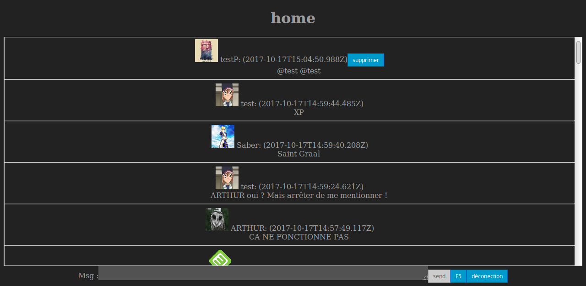

Sujet créer par [atomrc](https://github.com/atomrc).

## Connection

## Home

## loading

src : <https://giphy.com/gifs/loading-icon-cMU9cCdDHTHJm/>   

### Installation

:warning: nécessite Node.js

Vous aurez besoin de quelques outils avant de pouvoir commencer à coder. Pour les installer, jouer simplement :  
    `npm install`
à la racine du projet.

### Compilation des sources

Les sources sont écrite en utilisant une syntaxe ES6, pour être complétement sûr de la compatibilité du code, on va utiliser un transpileur pour le convertir en ES5 :  
    `npm run build`

Pour ne pas avoir à faire ça à chaque fois que vous faites une modification, vous pouvez lancer la commande :  
    `npm run watch`
qui compilera automatiquement les sources dès qu'il y a un changement dessus.
